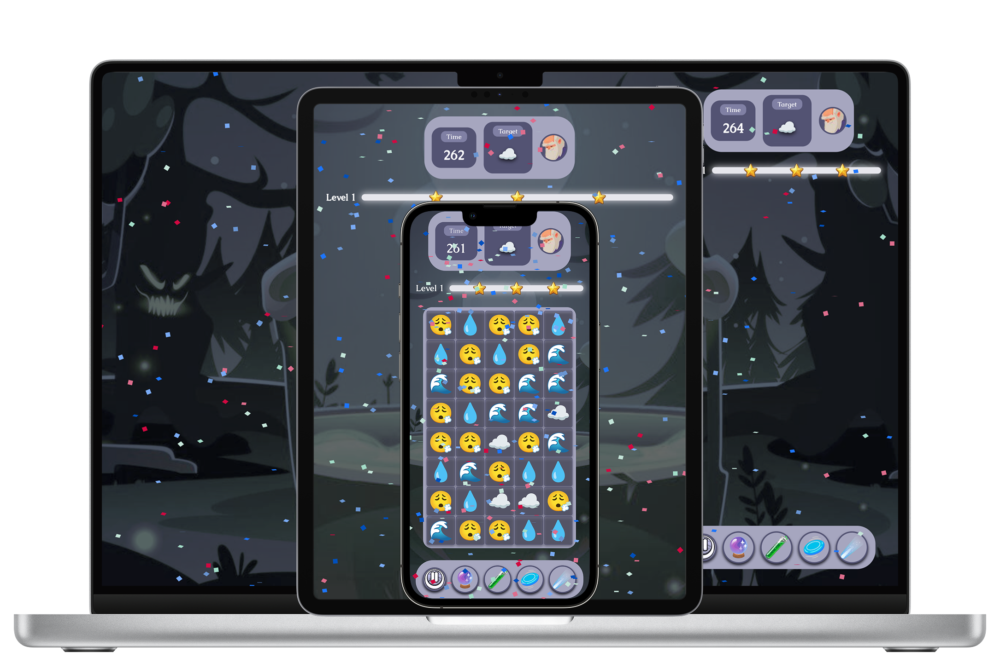

# Grimoji

A gothic alchemy game for mixing and collecting emojis.
 

### Documentation

### Credits

[Animated Emoji 💖](https://googlefonts.github.io/noto-emoji-animation/) for the emoji animations and SVG icons 
[Pixabay](https://pixabay.com/) for the sfx 
[Gemini](https://gemini.google.com/) for the music 
[Vecteezy](https://vecteezy.com/) for the background and pattern images 
[Audjust](https://www.audjust.com/studio) for sfx variations 
[Didier Boelens](https://medium.com/flutter-community/flutter-crush-debee5f389c3) for his amazing article on approaching match-3 in flutter 
[Mohamed Nasr](https://github.com/mohamedhaloka/Game-Levels-Scrolling-Map) for inspiring me with his game level scrolling map

