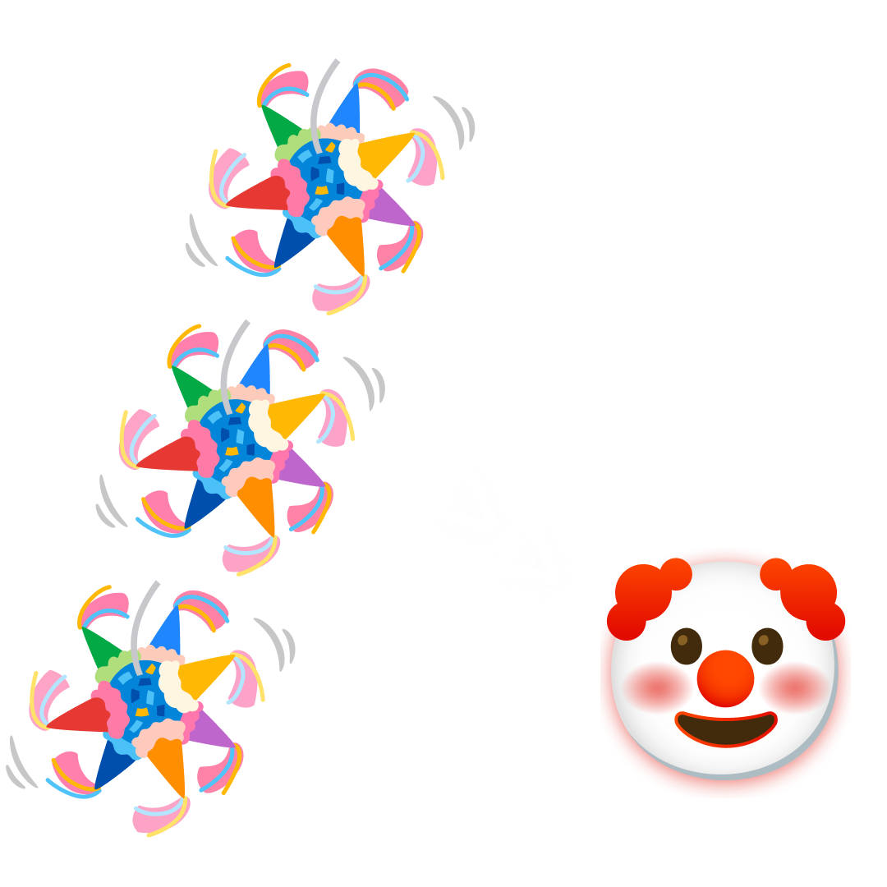
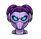

# [Gri[😬️]moji](https://grimoji.io)

A match-3 game that takes inspiration from classics like 2048 and candy crush to form an epic about mixing, merging, matching and collecting emojis.

<https://github.com/user-attachments/assets/ceef5a8d-0b00-4a09-b38c-49777ac84560>

## Quick Start

`git clone https://github.com/urGirlkiri/grimoji.git &&
cd grimoji &&
cp .env.example .env &&
flutter pub get &&
flutter run -d chrome`

> See the [setup guide](docs/SETUP.md) for platform-specific setup and run instructions.

## [Documentation](docs/)

## [Core Loops](lib/features/match)

This game revolves around...as you guessed emojis.

There are two main mechanics: `Matches` and `Merges`.

#### _Matches_: Just like Candy Crush, matching 3 or more emojis in any direction destroys stuff

#### _Merges_: Here comes the twist, matching certain emojis will, instead of self-destructing, complete a recipe and merge into a yield [more of that here](lib/features/alchemy/recipe_book.dart)

#### _Drop n Merge; Why not? On top of Suika,size accumulating, special emojis when they contact each other, they react and form emoji_ `Its like chemistry in a way`

## [Technologies Used](pubspec.yaml)

**Flutter and Dart**

I have fallen in love with Flutter after learning about its superpowers.

Write once, deploy everywhere. I made games before, but I only deployed to the web via itch.io; Flutter gives me the flexibility of one codebase for all platforms.

If you're lazy like me, then this is proof that it's very much possible.

**Provider + Hive**

For passing data around, what's more intuitive than notifiers? Or maybe it's just that they remind me of Godot Signals. Anyway, if you're coming from there like me, then this stack will be easy: `Provider` is the memory, and `Hive` is the hard drive.

On launch, the app opens Hive boxes for `Settings`, `Level`, and `ProfileData`. I use these boxes to persist settings, level progression and user stuff like your name and avatar. Provider Becomes the bridge, like RAM, it holds all the values in memory, periodically saving them when necessary _(i think)_  i.e if you win a new level or change your avatar .

**Flutter + Flame2D**

I thought you might ask. The match-3 grid and its mechanics are built in pure Flutter; the Suika-style cauldron is the onlt place it just makes sense to use a game engine.

For it, i cheated a bit and consulted  `flame` game engine and its `forge2d` mechanics that emulate real world physics. Am still figuring this out so more on that later

For match-3 _(candy crush style)_ see [board mechanics](lib/features/match/board/index) 

### Credits

[Animated Emoji 💖](https://googlefonts.github.io/noto-emoji-animation/) for the emoji animations and SVG icons 
[Pixabay](https://pixabay.com/) for the sfx and some music 
[Gemini](https://gemini.google.com/) for the music 
[Vecteezy](https://vecteezy.com/) for the background and pattern images 
[Audjust](https://www.audjust.com/studio) for sfx variations 
[Didier Boelens](https://medium.com/flutter-community/flutter-crush-debee5f389c3) for his amazing article on approaching match-3 in flutter 
[Mohamed Nasr](https://github.com/mohamedhaloka/Game-Levels-Scrolling-Map) for inspiring me with his game level scrolling map 
[Audio Trimmer](https://audiotrimmer.com/) for that extra touch :) 
[pikisuperstar on Magnific](https://www.magnific.com/author/pikisuperstar) for the hand drawn mascot

### License & Copyright

The source code of Grimoji is made available under the [PolyForm Noncommercial License 1.0.0](https://polyformproject.org/licenses/noncommercial/1.0.0). You are free to study, modify, and self-host the code for personal or educational purposes, but you may **not** use it for any commercial purpose (including ad revenue or paid deployment).

The "Grimoji" brand, custom artwork, UI designs, lore, and sfx are strictly **All Rights Reserved** by Ghetto Coders / Christin Nyakanyanga. They may not be reused or redistributed outside of personal, non-commercial mods of Grimoji itself.

