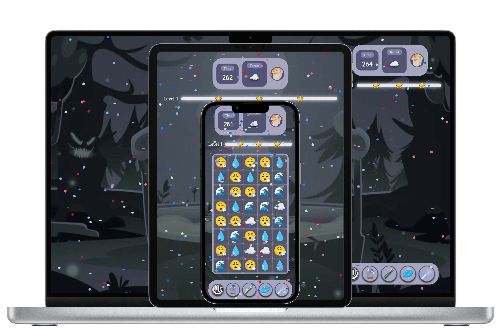
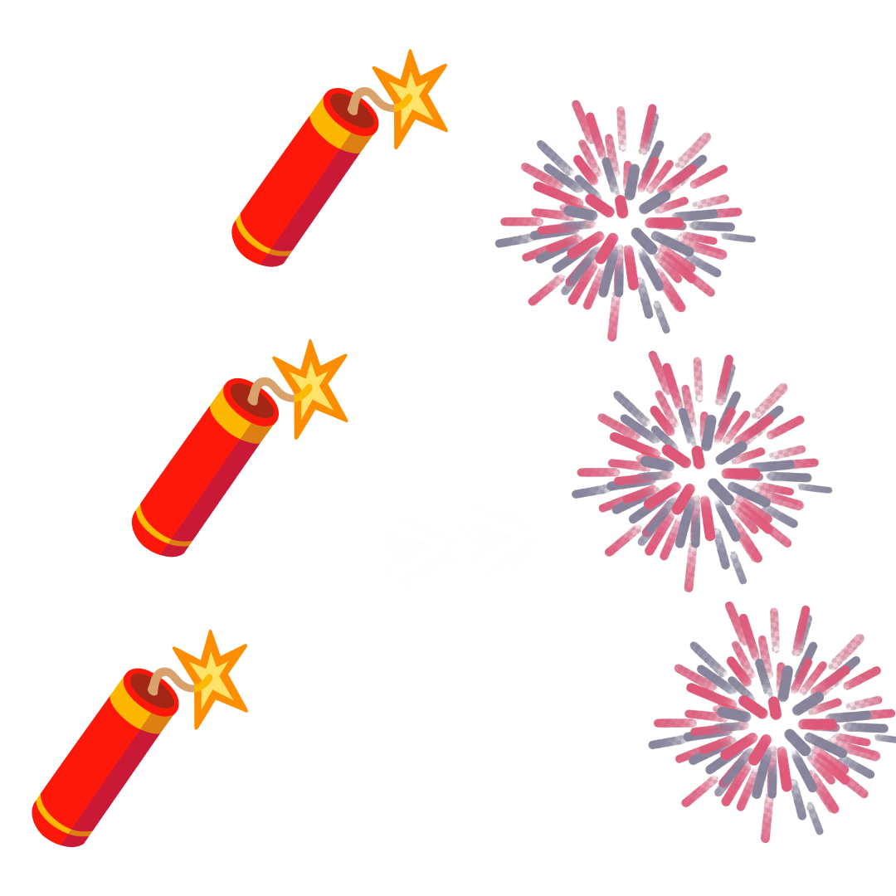
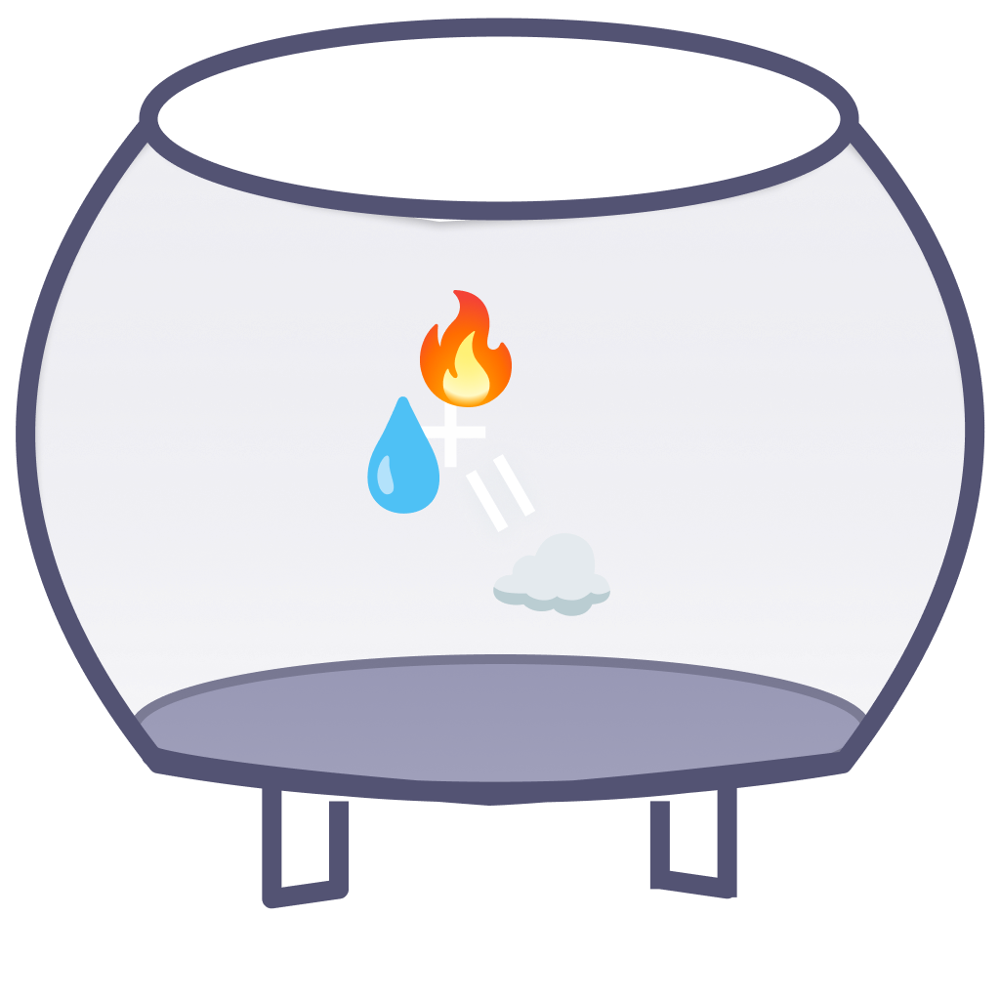
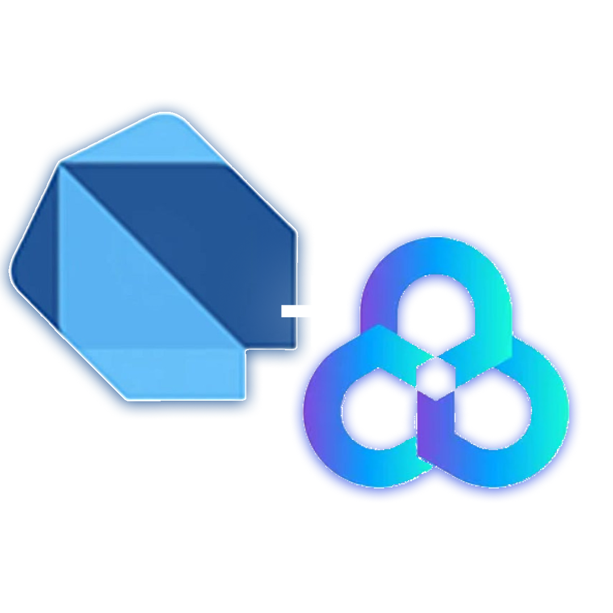

<div align="center">

# Grimoji

A gothic alchemy game for mixing and collecting emojis.
 



[](https://play.grimoji.io)
[](https://play.google.com/store/apps/details?id=io.grimoji.game)
[](https://apps.microsoft.com/detail/9PFZ6M6XMQ2P)
[](https://snapcraft.io/grimoji)
[](https://urgirlkiri.itch.io/grimoji)


https://github.com/user-attachments/assets/ceef5a8d-0b00-4a09-b38c-49777ac84560

### Quick Start

```bash
git clone https://github.com/urGirlkiri/grimoji.git
cd grimoji
cp .env.example .env
flutter pub get
flutter run -d chrome
```

> See the [setup guide](docs/SETUP.md) for platform-specific setup and run instructions.

### Documentation

<div align="center">

[](./docs/SETUP.md)
[](./docs/LOCAL_DEV.md)
[](./docs/RUNNING.md)
[](./docs/BUILDING.md)
[](./docs/DEPLOYING.md)

</div>

### Core Loops

This game revolves around emojis.
There are two main mechanics: `Matches` and `Merges`, illustrated in two modes.


#### _Match 3 — Candy Crush Style With a Twist: Instead of Crushing, You Merge and Form Emojis_




#### _Drop n Merge — Suika Style With a Twist: Instead of Accumulating Size, You Can React Emojis to Form Emojis_




### Technologies

**Flutter and Dart**


I have fallen in love with Flutter after learning about its superpowers.

Write once, deploy everywhere. I made games before, but I only deployed to the web via itch.io; Flutter gives me the flexibility of one codebase for all platforms.

If you're lazy like me, then this is proof that it's very much possible.

**Provider + Hive**




For passing data around, what's more intuitive than notifiers? Or maybe it's just that they remind me of Godot Signals. Anyway, if you're coming from there like me, then this stack will be easy: `Provider` is the memory, and `Hive` is the hard drive.

On launch, the app opens Hive boxes for `SettingsData`, `LevelData`, and `ProfileData`. `LevelDataController` keeps the local level completion and star counts in memory and writes the best results back to the box after every win. `ProfileController` does the same for the player profile, which also tracks which emojis and recipes have been unlocked in the recipe tree. Because `Hive` persists these records to disk, the map, grimoire unlocks, and player currency all survive cold starts.

**Flutter + Flame2D**


I thought you might ask. The match-3 is pure Flutter; the Suika-style cauldron is where it just makes sense to use a game engine.

Under the hood, `flame_forge2d` runs the rigid-body physics, while a custom Dart backend resolves every collision and spawn. When emojis make contact, the engine checks the recipe group size through `RecipeBook`, promotes the matching ingredient to the next-tier yield, and looks up any special `BehaviorRegister` or `Reaction` triggers. This keeps the merge logic deterministic and lets the recipe tree be validated and cached in memory on app start.


### Credits

[Animated Emoji 💖](https://googlefonts.github.io/noto-emoji-animation/) for the emoji animations and SVG icons<br>
[Pixabay](https://pixabay.com/) for the sfx and some music<br>
[Gemini](https://gemini.google.com/) for the music<br>
[Vecteezy](https://vecteezy.com/) for the background and pattern images<br>
[Audjust](https://www.audjust.com/studio) for sfx variations<br>
[Didier Boelens](https://medium.com/flutter-community/flutter-crush-debee5f389c3) for his amazing article on approaching match-3 in flutter<br>
[Mohamed Nasr](https://github.com/mohamedhaloka/Game-Levels-Scrolling-Map) for inspiring me with his game level scrolling map<br>
[Audio Trimmer](https://audiotrimmer.com/) for that extra touch :)<br>
[pikisuperstar on Magnific](https://www.magnific.com/author/pikisuperstar) for the hand drawn mascot 

### License & Copyright

The source code of Grimoji is made available under the [PolyForm Noncommercial License 1.0.0](https://polyformproject.org/licenses/noncommercial/1.0.0). You are free to study, modify, and self-host the code for personal or educational purposes, but you may **not** use it for any commercial purpose (including ad revenue or paid deployment).

The "Grimoji" brand, custom artwork, UI designs, lore, and sfx are strictly **All Rights Reserved** by Ghetto Coders / Christin Nyakanyanga. They may not be reused or redistributed outside of personal, non-commercial mods of Grimoji itself.
</div>