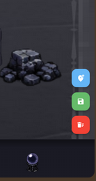
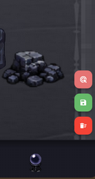

# Local Development

## Map Builder

Set the `MAP_BUILDER_MODE` env to either `true` / `false` to toggle dev or prod.

When `MAP_BUILDER_MODE=true` you have access to the map builder interface but won't be able to play levels.

### Controls 
* Press `C` to toggle placement and delete mode
* `Ctr-Z` to Undo
* `Ctr-Y` to Redo Changes

You can also use the floating buttons.

<p align="center">
  
  
</p>

## Logging

```dart
import 'package:logging/logging.dart';

final _log = Logger('Foo');

void foo() {
  _log.info('Hello, world!');
}
```

This will show up in the console as:

```text
[Foo] Hello, world!
```

When using Flutter DevTools, all the metadata of the log message is preserved, so you can filter by logger name, log level, and so on.